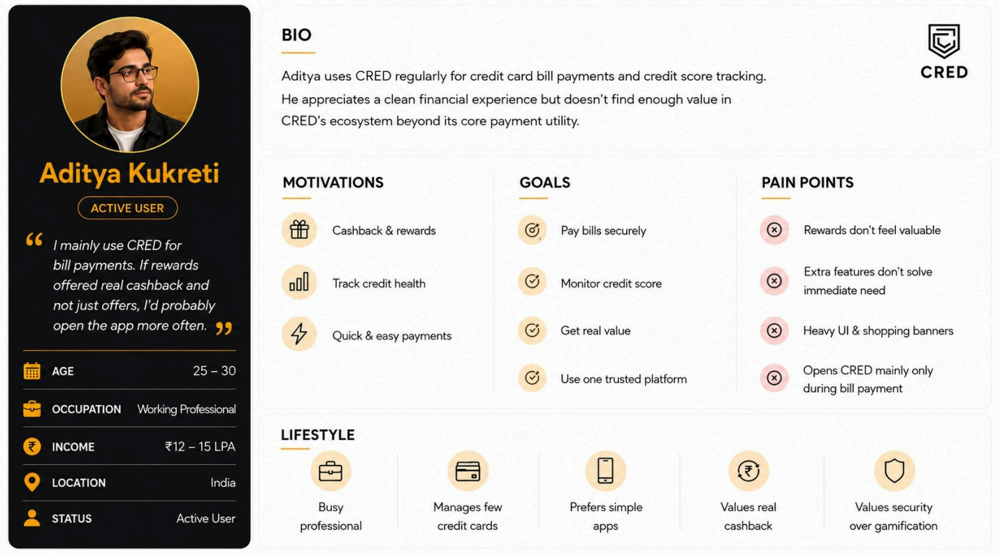
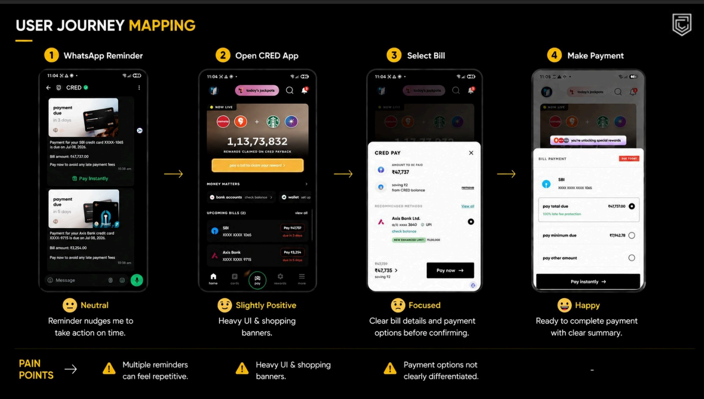
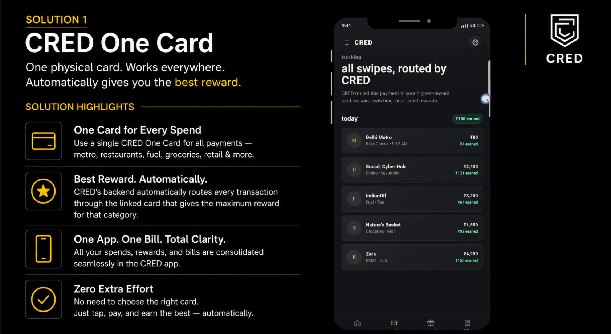

# 🚀 CRED Product Case Study: Increasing Mid-Month User Engagement

> A research-driven Product Management case study proposing data-backed solutions to increase CRED's mid-month user engagement — grounded in user interviews, competitive analysis, journey mapping, and measurable success metrics.

---

## 📌 Executive Summary

**Problem:** CRED is used almost exclusively for monthly bill payments — users pay, collect rewards, and exit. Premium features (Garage, Mint, Store, Travel) go undiscovered, limiting cross-feature adoption and long-term customer lifetime value.

**Insight:** Unlike Google Pay or PhonePe, which fit naturally into daily transactions, CRED has no recurring reason to open the app between bill cycles — reward fatigue, a cluttered homepage, and poor feature discoverability compound the problem.

**Solution:** Two product directions — **CRED One Card** (automatic reward-optimized card selection across a user's linked cards) and **CRED Lite** (a stripped-down, two-action interface for users who just want to pay fast) — designed to pull users back mid-month without diluting CRED's premium positioning.

**Success measure:** A new North Star Metric, **Monthly Financially Engaged Users (MFEU)** — users who open CRED on a non-bill day and complete a meaningful financial action — replacing simple app-open counts with a metric tied to actual value delivered.

📄 Full research, personas, and journey maps: see [`CRED CASE.pdf`](./CRED%20CASE.pdf) · 🎥 [Interactive deck with video walkthrough](https://canva.link/rjk0ekvputf41sl)

---

## 📽️ Interactive Product Deck

👉 [View the Complete Interactive Product Deck](https://canva.link/rjk0ekvputf41sl) *(includes embedded videos)*

If the link is unavailable, the full static deck is in this repo as [`CRED CASE.pdf`](./CRED%20CASE.pdf).

---

## 📖 Background

CRED has established itself as India's premium credit card payment platform by rewarding users for timely bill payments. Over time it has expanded into CRED Pay, UPI Payments, CRED Store, CRED Garage, CRED Mint, Travel, Shopping, and Financial Services — yet a significant share of users still treat CRED purely as a bill-payment utility:

**Receive reminder → Open app → Pay → Collect reward → Exit.**

This case study investigates *why* that happens and proposes interventions that turn CRED into a daily financial companion rather than a monthly utility — without compromising its premium feel.

---

## 🎯 Problem Statement

**How might we increase meaningful user engagement on CRED during non-bill days while maintaining the platform's premium experience?**

The objective isn't more app opens — it's getting users to interact with valuable financial features throughout the month.

---

## 🔬 Product Thinking Framework

```
Problem Identification → Market Research → Competitive Analysis → User Research
        → Persona Creation → Journey Mapping → Pain Point Prioritization
        → Solution Ideation → Success Metrics
```

Every recommendation below traces back to a research finding, not an assumption.

---

## 🔍 Research Methodology

**Primary research:** 12 semi-structured user interviews, 30 survey responses, and follow-up discussions with regular CRED users — covering usage patterns, motivations, feature awareness, reward perception, and payment-journey friction.

**Secondary research:** Play Store / App Store reviews, Reddit and community forum discussions, and existing product teardown to validate recurring themes across a wider base.

---

## 📊 Key Research Insights

| # | Insight |
|---|---|
| 1 | Users associate CRED almost entirely with bill payment, despite its broader ecosystem |
| 2 | Rewards have shifted from meaningful cashback to promotional coupons — post-payment excitement has dropped |
| 3 | Garage, Mint, Store, and Travel are buried and poorly discoverable |
| 4 | The homepage's banner/promotion density creates cognitive overload instead of exploration |
| 5 | Unlike Google Pay or PhonePe, CRED has no natural recurring-use trigger between bill cycles |

---

## 🌍 Competitive Landscape (illustrative)

| Dimension | CRED | Google Pay / PhonePe |
|---|---|---|
| Primary use trigger | Monthly bill due date | Daily transactions (UPI, recharges, bills) |
| Session frequency driver | Reminder-based | Habit-based |
| Engagement between "core" actions | Minimal | High (P2P, scan-and-pay, recharges) |
| Reward perception | Declining (coupon fatigue) | Cashback tied to frequent, small transactions |

This framing is qualitative, based on the positioning described in research — see the deck for the full competitive teardown with sourced detail.

---

## 👥 User Personas & Journey

Personas were built around background, goals, motivations, financial habits, and product expectations — used to validate that proposed solutions solve real friction, not hypothetical problems. The journey map below shows engagement dropping sharply right after payment completion — the core gap this case study addresses.




---

## 💡 Proposed Solution 1 — CRED One Card

**Vision:** One intelligent payment card that automatically selects the best linked credit card for every purchase, so users don't have to track which card offers the highest reward.

**Benefits:** Single card for all payments · automatic reward optimization · unified transaction history · better spending insights · higher daily usage.



## 💡 Proposed Solution 2 — CRED Lite

**Vision:** A lightweight CRED experience stripped to two actions — **Pay** and **Bill** — for users who want speed over discovery.

**Benefits:** Faster navigation · lower cognitive load · improved accessibility · higher satisfaction for a "just let me pay" segment.

---

## ⚠️ Risks & Open Questions

Being upfront about what these solutions assume and where they could break:

- **CRED One Card** depends on deep integration with competing banks' card networks and reward systems — issuer partnerships may not be commercially or technically feasible at CRED's current scale, and this needs validation before build investment.
- **CRED Lite** risks cannibalizing engagement with the very features (Garage, Mint, Store) this case study is trying to promote — a "fast lane" could reduce, not increase, exposure to underused products. Needs a clear cohort strategy (who defaults to Lite vs. full CRED).
- **MFEU as North Star** assumes "meaningful financial action" can be defined and tracked consistently across features — this definition needs product + data alignment before it can be reported reliably.
- Reward-fatigue findings are based on 12 interviews and 30 survey responses — directionally useful, but a larger sample would be needed before shipping against these conclusions.

---

## ⭐ Success Measurement

**North Star Metric — Monthly Financially Engaged Users (MFEU):** a user is financially engaged if they open CRED on a non-bill day and complete at least one meaningful financial action. This shifts focus from app opens to actual value delivered.


**L1 supporting metrics:** mid-month opens per user · cross-feature adoption · CRED UPI share · weekly payment frequency

**L2 supporting metrics:** activation rate · feature CTR · conversion rate · user trust score · feature discovery rate

---

## 🛠 Skills Demonstrated

Product Strategy · User Research · Product Discovery · Problem Framing · Market Research · Competitive Benchmarking · UX Research · User Interviews · Survey Analysis · Persona Development · Journey Mapping · Product Ideation · Prioritization · KPI Design · North Star Metrics · Business Thinking · Data Interpretation · Product Storytelling

---

## 📂 Repository Contents

```
📄 CRED CASE.pdf        — full product deck (research, personas, journey map, solutions, metrics)
📄 README.md            — this overview
📁 image/              — key deck pages embedded above, for quick skimming without opening the PDF
```

---

## 🎓 Key Learnings

**Successful products aren't built by adding more features — they're built by deeply understanding user behavior and solving the right problems.**

This project reflects how product managers work in practice: validate assumptions through research, prioritize problems using evidence, design user-centric solutions, and define measurable outcomes to evaluate success — rather than proposing features first and justifying them after.

---

**Author:** Anish 
